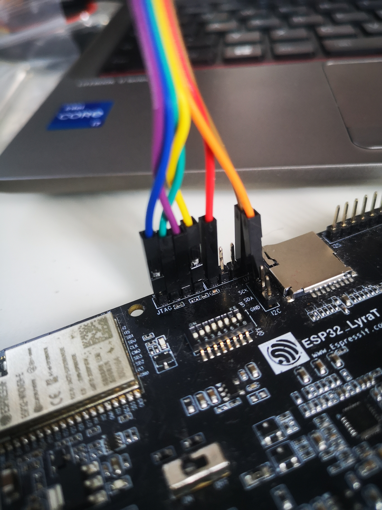

these arduino sketces are all experiments. I tried to make the nrf24 work, with hte boards i had, the lyraT and the esp32 S3.
The lyraT can be used when the pins of the JTAG interface are enabled. The dipswitch needs to be set accordingly.
The code is very basic, using sample code of the different libraries. 

lyraT dipswitch

https://espressif-docs.readthedocs-hosted.com/projects/esp-adf/en/latest/design-guide/dev-boards/board-esp32-lyrat-v4.3.html#id12

